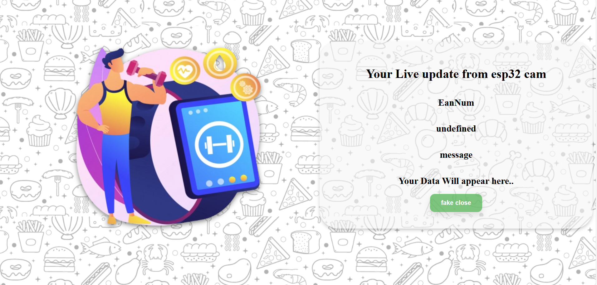

# 🍽️ NutriScan Backend – Food Suitability Analysis API 

This is the backend system for the NutriScan wearable project. It handles barcode-based food product analysis by decoding the EAN number, fetching product details, and matching ingredients with user-specific dietary restrictions. This backend is built with **Node.js**, **Express.js**, and integrates with **Firebase** for user data and result storage.

---

## 🚀 Live Server

🔗 Hosted API: [https://nutriscan-backend-api.onrender.com](https://nutriscan-backend-api.onrender.com)

---

## 🛠️ Tech Stack

- **Node.js + Express.js** – Web server and route handling
- **Firebase Realtime Database** – For storing user preferences and scan results
- **Firebase Authentication** – User identification using Wi-Fi password
- **Axios** – To fetch product data using barcode
- **EJS** – For rendering basic frontend test pages
- **Render.com** – For hosting the backend server

---

## 🧪 Key Functionalities

- `/fastapires` – Sets message during processing of barcode decoding via response obtained from fast api 
- `/nutri` – Accepts decoded EAN + user Wi-Fi ID, fetches product info, matches ingredients and nutrition against the user’s dietary profile from Firebase.
- `/faker` – for testing of barcode lookup api,processing and comaprision and not meant to be used
- `/message` and `/nutro` – Used by frontend dashboard to fetch latest results and response messages.
-`/`-simple frontend for testing pupose only not meant to be accessed
---
## Fake UI pics

