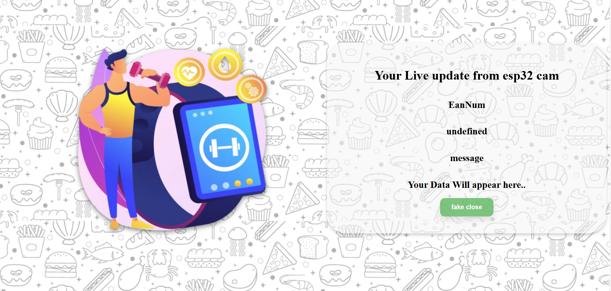

# 🍽️ NutriSentrix Backend – Food Suitability Analysis API 

This is the backend system for the NutriScan wearable project. It handles barcode-based food product analysis by decoding the EAN number, fetching product details, and matching ingredients with user-specific dietary restrictions. This backend is built with **Node.js**, **Express.js**, and integrates with **Firebase** for user data and result storage.

## 🛠️ Tech Stack

- **Node.js + Express.js** – Web server and route handling
- **Firebase Realtime Database** – For storing user preferences and scan results
- **Firebase Authentication** – User identification using Wi-Fi password
- **Axios** – To fetch product data using barcode
- **EJS** – For rendering basic frontend test pages
- **Render.com** – For hosting the backend server

---

## 🧪 Key Functionalities

- `/nutri` – Accepts decoded EAN + user Wi-Fi ID, fetches product info, matches ingredients and nutrition against the user’s dietary profile from Firebase.
- `/NoBarcode` – POST route for products without barcodes; accepts image data (gemini_response or gemini_json) and wifiid, processes with Gemini AI, verifies user, and returns suitability analysis based on standards and user preferences.
-`/`-simple frontend for testing pupose only not meant to be accessed
---
## Fake UI pics

